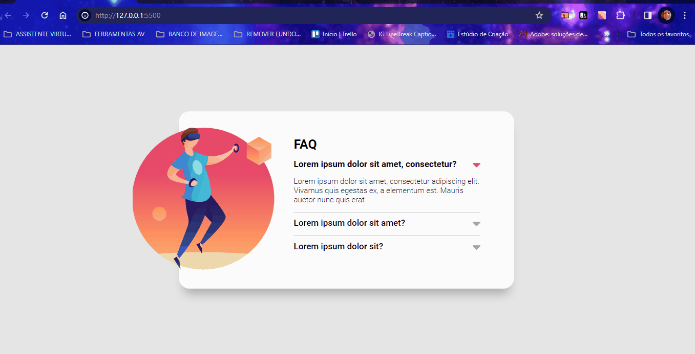

# PROJETO ACORDEON
Um projeto acordeon onde foi utilizado o HTML, CSS e Javascript utilizando imagens, textos com setas clicáveis para avançar e retornar as respostas de perguntas telas de computadores💻

 

## Tecnologias utilizadas
- HTML
- CSS
- JAVASCRIPT

## 📂Acesso ao projeto

**Você pode acessar o código fonte do projeto 

<https://github.com/denisero19/acordeon>**